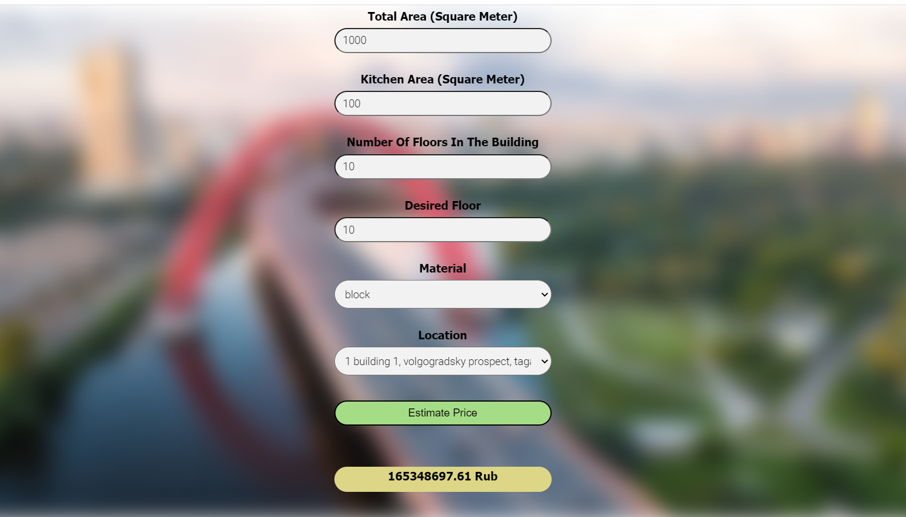

# Moscow Real Estate Prediction Project

## Project Objectives:
The objective of this project is to create a machine learning model (supervised learning) predicting Moscow real estate price implemented in user-friendly web application.

## Modeling:
The analysis and model creation can be found in the .ipynb file.
The main packages used are numpy, pandas, matplotlib, seaborn and sklearn.
